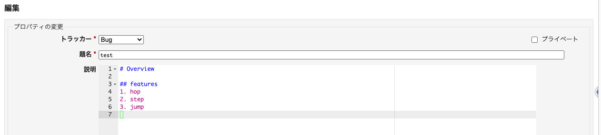

# Redmine [Ace Editor](https://ace.c9.io/) plugin

[](https://redmine3-backlogs.duckdns.org/redmine4/projects/public_project/issues/new)

## Features

- markdown syntax highlighting
- indent, indent-region
- isearch
- and more

Keybind and theme of editor is configurable with "My account" preference.

## TODO

- test plugin
- add [translations](tree/master/config/locales)
- add toolbar of redmine wiki
  - preview
- support pandoc format (markdown)

## Reference
* [gjroelofs/redmine_codemirror](https://github.com/gjroelofs/redmine_codemirror)
* [Edit with Emacs](https://chrome.google.com/webstore/detail/edit-with-emacs/ljobjlafonikaiipfkggjbhkghgicgoh)

## Third-party libraries

* [ace editor](https://ace.c9.io/): Copyright (c) 2010, Ajax.org B.V.  [License](assets/javascripts/ace/LICENSE)

## License

```
Copyright (c) 2020 Takashi Masuyama. All rights reserved.

Licensed under the Apache License, Version 2.0 (the "License");
you may not use this file except in compliance with the License.
You may obtain a copy of the License at

   http://www.apache.org/licenses/LICENSE-2.0

Unless required by applicable law or agreed to in writing, software
distributed under the License is distributed on an "AS IS" BASIS,
WITHOUT WARRANTIES OR CONDITIONS OF ANY KIND, either express or implied.
See the License for the specific language governing permissions and
limitations under the License.
```

----
Takashi Masuyama < mamewotoko@gmail.com >

https://mamewo.ddo.jp/
